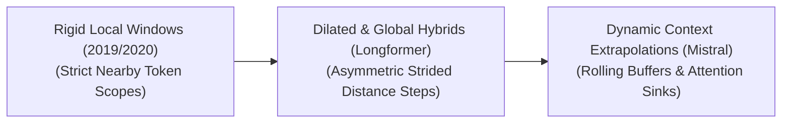

# 🧠 Awesome Sliding Window Attention 🚀

    

A curated, SEO-friendly collection of evolution, variants, types, and applications of **Sliding Window Attention** (Local Attention) in Transformer architectures.

---

## 📌 Table of Contents
- [📖 Introduction](#-introduction)
- [⏳ 1. The Chronological Evolution](#-1-the-chronological-evolution)
- [🔧 2. Core Functional & Structural Variants](#-2-core-functional--structural-variants)
- [💾 3. High-Yield Cache Management Types](#-3-high-yield-cache-management-types)
- [⚙️ 4. Production Engineering Challenges & Hardware Trade-Offs](#-4-production-engineering-challenges--hardware-trade-offs)
- [🚀 5. Frontier Real-World Applications](#-5-frontier-real-world-applications)

## 📖 Introduction

Sliding Window Attention—also known as Local Attention—is a structural sparsification technique designed to mitigate the quadratic computational complexity ($O(N^2)$) and VRAM bottlenecks of standard Full Self-Attention in Transformer models. In full attention, every token must compute an attention score with every other token in a sequence, making long-context processing (e.g., full books, long videos, or massive code repositories) highly inefficient. Sliding Window Attention restricts each token's attention field to a fixed, localized neighborhood (a "window") of adjacent tokens, dropping the computational and memory footprint down to true linear scaling ($O(N \times W)$), where $W$ is the window width.

---

## ⏳ 1. The Chronological Evolution

The implementation of sliding window mechanisms has evolved from rigid, localized text boundaries to multi-scale hybrid configurations capable of maintaining long-range context without quadratic overhead.

| Era / Phase | Core Concept & Limitations | Year First Used | First Paper |
| :--- | :--- | :---: | :--- |
| [**The Flat Heuristic Era (Early Local Attention, ~2019–2020)**](./details/flat-heuristic-era.md) | **Concept:** Tokens were forced into strict, symmetric localized blocks (a token at index $i$ could only look at keys within $i \pm W/2$). **Limitation:** Lacked global context mapping, severely limiting the model's ability to link distant themes or handle multi-turn narrative flows in early layers. | 2019 | [Sparse Transformers (Child et al.)](https://arxiv.org/abs/1904.10509) [Adaptive Attention Span (Sukhbaatar et al.)](https://arxiv.org/abs/1905.07799) |
| [**The Structured Hybrid Era (Longformer / BigBird, ~2020–2022)**](./details/structured-hybrid-era.md) | **Concept:** Combined sliding windows with global anchors (e.g., the `[CLS]` token) and dilated gaps, allowing high-level abstract information to skip long distances across the sequence vector. **Limitation:** Suffered from hardware implementation penalties, as unstructured or irregular sparse masks do not align well with dense GPU tensor core processing. | 2020 | [Longformer (Beltagy et al.)](https://arxiv.org/abs/2004.05150) [Big Bird (Zaheer et al.)](https://arxiv.org/abs/2007.14062) |
| [**The Modern Rolling Cache & Attention Sink Era (~2023–Present)**](./details/modern-rolling-cache-sink-era.md) | **Concept:** Popularized by architectures like **Mistral 7B** and algorithms like **StreamingLLM**. It refactored sliding window attention into a hardware-fused caching mechanism, using fixed-size rolling Key-Value (KV) buffers paired with permanent "attention sinks" to maintain linguistic stability indefinitely. | 2023 | [StreamingLLM (Xiao et al.)](https://arxiv.org/abs/2309.17453) [Mistral 7B (Jiang et al.)](https://arxiv.org/abs/2310.06825) |

---

## 🔧 2. Core Functional & Structural Variants

Sliding window attention is deployed using distinct layout configurations that alter how information travels across the deep layers of a Transformer.

| Variant | Mechanism & Receptive Field / Pros | Year First Used | First Paper |
| :--- | :--- | :---: | :--- |
| [**Standard Vanilla Sliding Window**](./details/standard-vanilla-sliding-window.md) | **Mechanism:** A rigid, symmetric mask where the attention scope is bounded tightly around the target token. **Receptive Field Expansion:** While a single layer is strictly localized, stacking $L$ layers creates a deep hierarchical architecture. The effective receptive field expands linearly with depth ($L \times W$), allowing the top layers to naturally capture long-range semantic dependencies. | 2020 | [Longformer (Beltagy et al.)](https://arxiv.org/abs/2004.05150) (NLP) [Image Transformer (Parmar et al.)](https://arxiv.org/abs/1802.05751) (Vision) |
| [**Dilated / Strided Sliding Window**](./details/dilated-strided-sliding-window.md) | **Mechanism:** The sliding window skips adjacent tokens at a regular, fixed periodic interval (e.g., checking keys at indices $i-2, i-4, i-6$ within a window). **Pros:** Doubles or quadruples the visual or textual span of the window without expanding the absolute token calculation budget. | 2020 | [Longformer (Beltagy et al.)](https://arxiv.org/abs/2004.05150) |
| [**Asymmetric Causal Sliding Window**](./details/asymmetric-causal-sliding-window.md) | **Mechanism:** Tailored for autoregressive generation models. The window opens exclusively backward into historical tokens (e.g., a token at index $i$ attends to indices from $i-W$ to $i$), completely masking out future tokens. | 2020 | [Longformer (Beltagy et al.)](https://arxiv.org/abs/2004.05150) (NLP) [Image Transformer (Parmar et al.)](https://arxiv.org/abs/1802.05751) (Vision) |

---

## 💾 3. High-Yield Cache Management Types

Managing the Key-Value (KV) cache during continuous sliding window inference dictates the latency profile and memory consumption of production systems.

| Cache Management Type | Mechanism & Pros | Year First Used | First Paper |
| :--- | :--- | :---: | :--- |
| [**Rolling KV Cache (Mistral Framework)**](./details/rolling-kv-cache.md) | **Mechanism:** The system maintains a fixed-capacity VRAM cache equal to the window size $W$. When generating token $i$, its KV coordinates overwrite the memory slot of token $i-W$ using a modulo operation (`i % W`). **Pros:** Completely bounds KV cache VRAM inflation. VRAM consumption remains flat and unchanging whether the model generates 100 tokens or 100,000 tokens. | 2023 | [Mistral 7B (Jiang et al.)](https://arxiv.org/abs/2310.06825) |
| [**Attention Sink Augmentation (StreamingLLM)**](./details/attention-sink-augmentation.md) | **Mechanism:** Discovers that the absolute first 2 to 4 tokens in a sequence act as an "attention sink," absorbing massive amounts of attention gravity. The cache keeps these initial tokens permanently frozen in memory, while applying a sliding rolling window to all subsequent generations. **Pros:** Prevents catastrophic perplexity explosions during infinitely long streaming text generation loops. | 2023 | [StreamingLLM (Xiao et al.)](https://arxiv.org/abs/2309.17453) |

---

## ⚙️ 4. Production Engineering Challenges & Hardware Trade-Offs

While sliding window attention provides a clear mathematical optimization path, hardware integration presents distinct engineering constraints.

| Engineering Challenge | The Problem & Mitigation | Year First Used | First Paper |
| :--- | :--- | :---: | :--- |
| [**The FlashAttention Kernel Compatibility Gap**](./details/flashattention-kernel-compatibility.md) | **The Problem:** Standard sliding window masks introduce non-contiguous memory reading indexing. If executed naively, the GPU spends too much time fetching disjointed tensor addresses, erasing theoretical speedups. **Mitigation:** Utilizing **Block-Local FlashAttention Kernels** (like those in vLLM or Hugging Face Text Generation Inference), which execute the sliding window constraints over coarse, contiguous $64 \times 64$ block tiles rather than individual token matrices. | 2023 | [FlashAttention-2 (Dao)](https://arxiv.org/abs/2307.08691) [FlashAttention (Dao et al.)](https://arxiv.org/abs/2205.14135) |
| [**The Distant Retrieval Loss (The "Goldfish Memory" Penalty)**](./details/distant-retrieval-loss.md) | **The Problem:** If a user prompt requires retrieving a highly specific fact buried deep in a 50,000-word document, a standard sliding window model will discard that information from its rolling cache before it reaches the generation layer. **Mitigation:** Restricting sliding window execution strictly to intermediate encoder layers, while forcing terminal cross-attention blocks to maintain full, un-sparsified attention visibility. | 2023 | [Lost in the Middle (Liu et al.)](https://arxiv.org/abs/2307.03172) |

---

## 🚀 5. Frontier Real-World Applications

| Application Field | Application Context & Impact | Year First Used | First Paper |
| :--- | :--- | :---: | :--- |
| [**Continuous Real-Time Streaming Log Analysis**](./details/real-time-streaming-log-analysis.md) | Monitors high-volume enterprise server logs or active network traffic pipelines 24/7. Rolling sliding window models parse incoming signal strings continuously, flagging security anomalies based on local context windows without overloading system RAM over weeks of operation. | 2021 | [LogBERT (Guo et al.)](https://arxiv.org/abs/2103.03050) |
| [**Edge Device Conversational Assistants**](./details/edge-device-conversational-assistants.md) | Deployed on consumer laptops, smartphones, or smart home devices. Limiting the KV cache to a strict local rolling window allows compact models to maintain infinite multi-turn conversations without saturating the device's restricted unified memory architecture. | 2024 | [MobileLLM (Zhao et al.)](https://arxiv.org/abs/2402.14905) |
| [**High-Frame-Rate Video Comprehension**](./details/high-frame-rate-video-comprehension.md) | Processes long security or autonomous driving camera feeds. Because video features exhibit massive temporal redundancy between adjacent frames, a temporal sliding window attention layer focuses the model's capacity on short-range motion transitions, ignoring frames from hours prior. | 2021 | [Video Swin Transformer (Liu et al.)](https://arxiv.org/abs/2106.13230) [TimeSformer (Bertasius et al.)](https://arxiv.org/abs/2102.05095) |

