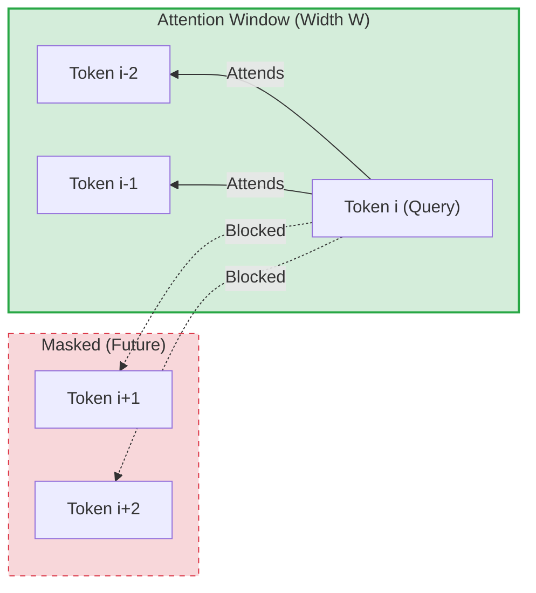

# Asymmetric Causal Sliding Window Attention

## Overview
In autoregressive text generation, future tokens must be masked to prevent the model from looking ahead. **Asymmetric Causal Sliding Window Attention** adapts local attention to this causal constraint.

## Mechanism
The sliding window opens exclusively backward into historical tokens. A query token at index $i$ only attends to keys in the range:
$$\left[ i - W, i \right]$$

All future tokens ($j > i$) are masked out.

## Key Applications
- **Autoregressive Decoders:** Foundational to modern LLMs (e.g., LLaMA, Mistral, GPT models) to enable efficient next-token prediction.

## Diagram

---
[← Back to README](../README.md)
