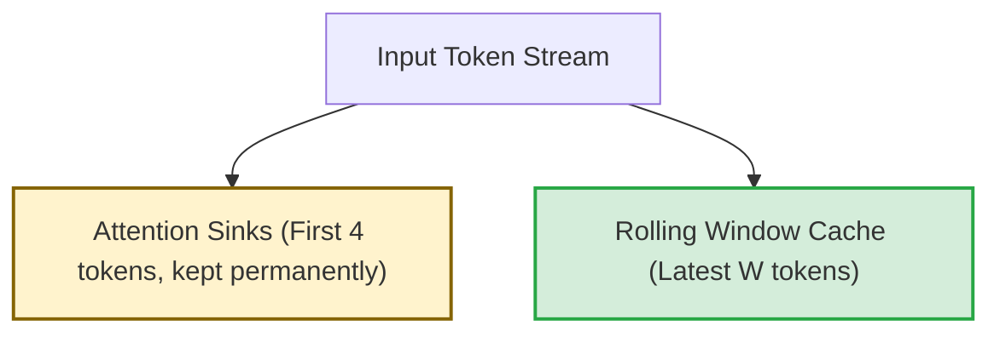

# Attention Sink Augmentation (StreamingLLM)

## Overview
During long-context streaming, standard sliding window cache setups cause perplexity to explode. **Attention Sink Augmentation** fixes this by retaining crucial structural tokens.

## The Attention Sink Phenomenon
Due to the softmax operator in self-attention, attention scores must sum to 1. The model assigns high attention values to initial tokens (e.g., the first 2-4 tokens) simply as an anchor, regardless of their semantic meaning. When these tokens are evicted from a standard sliding window, the model's attention distribution collapses, causing a performance spike.

## Mitigation
Permanently freeze the first 2-4 tokens in the KV cache, while applying a rolling cache to all subsequent tokens.

## Diagram

---
[← Back to README](../README.md)
