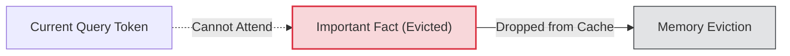

# The Distant Retrieval Loss (The "Goldfish Memory" Penalty)

## The Problem
If a model uses a sliding window attention mechanism, it will evict older tokens from the cache. If a query requires retrieving a specific fact from earlier parts of a document that have been evicted, the model cannot access it, resulting in the **"Goldfish Memory" Penalty**.

## Mitigation
- **Layer-wise Hybridization:** Keep full attention on intermediate or terminal cross-attention layers, while using sliding windows for standard attention layers.
- **Global Anchor Tokens:** Maintain designated global tokens that aggregate information from evicted segments.

## Diagram

---
[← Back to README](../README.md)
