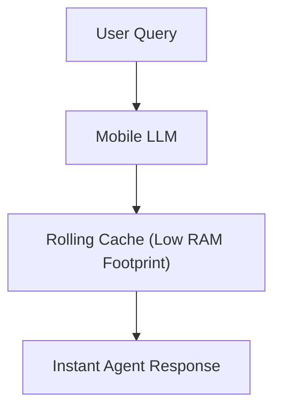

# Edge Device Conversational Assistants

## Overview
Edge device deployments (smartphones, laptops) are strictly constrained by unified memory architectures and power limits. Sliding window attention reduces the KV cache size, making on-device conversational agents feasible.

## Key Implementation
- **MobileLLM (Zhao et al., 2024):** Restricts cache footprint using structured local-global hybrid attention configurations tailored for sub-billion parameter models.

## Diagram

---
[← Back to README](../README.md)
