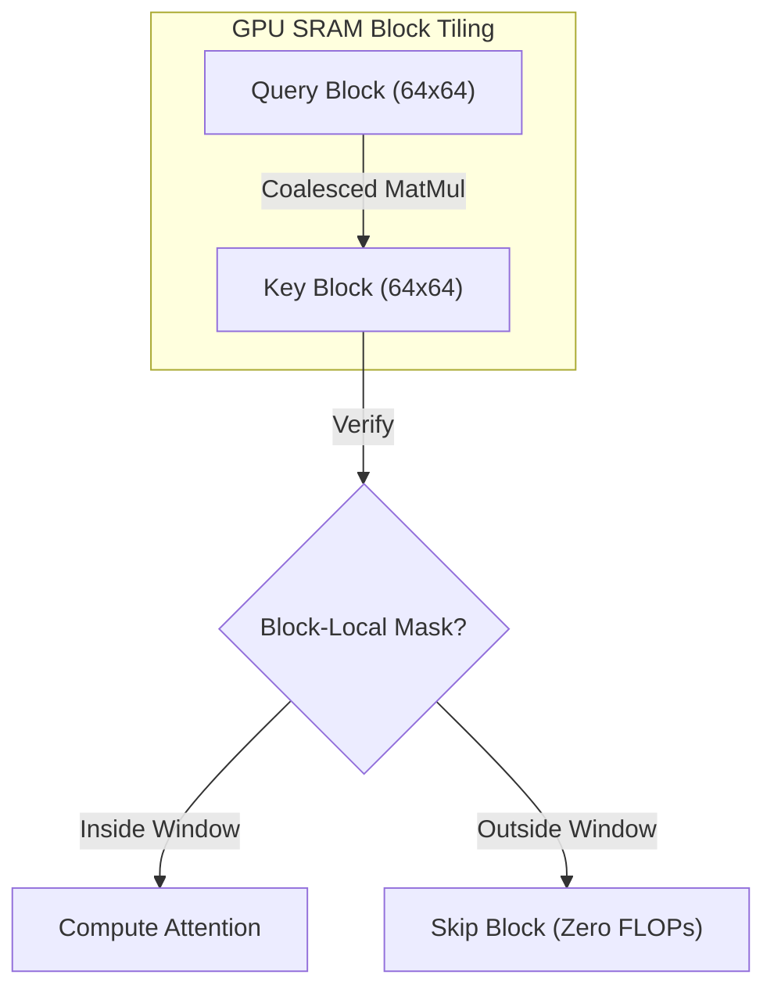

# The FlashAttention Kernel Compatibility Gap

## The Problem
Standard sliding window masks introduce non-contiguous memory reading indexing. While mathematically simple, implementing arbitrary masking in GPUs causes non-coalesced memory fetches, which nullifies the speedups of FlashAttention.

## Mitigation
**Block-Local FlashAttention Kernels** (used in vLLM, Hugging Face TGI) group the attention operation into coarse, contiguous $64 \times 64$ blocks. The sliding window constraint is applied on these block tiles rather than individual tokens, preserving GPU SRAM tiling speed.

## Diagram

---
[← Back to README](../README.md)
