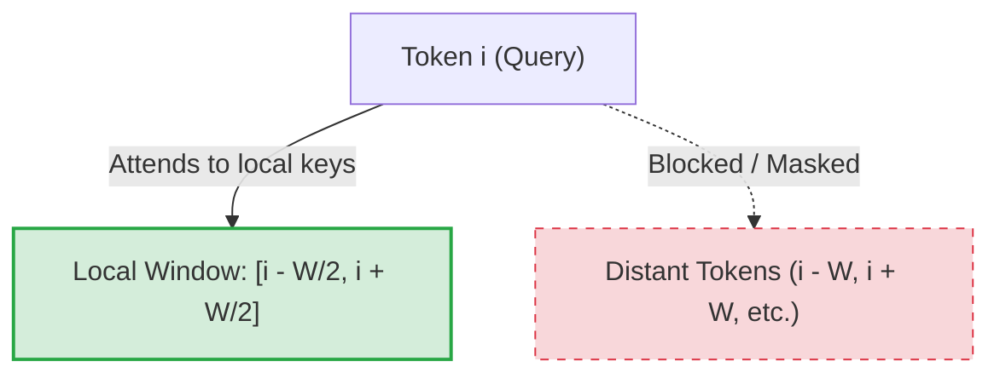

# The Flat Heuristic Era (Early Local Attention, ~2019–2020)

## Overview
During the early development of Transformer architectures, researchers sought to mitigate the quadratic computational complexity ($O(N^2)$) and memory consumption of full self-attention. The **Flat Heuristic Era** introduced basic local attention configurations as a structural simplification.

## Core Concept
Instead of allowing every token to attend to every other token in the sequence, attention was restricted to a fixed, symmetric neighborhood surrounding each token. 
For a query token at index $i$ and a window size $W$, attention was only computed for keys in the range:
$$\left[ i - \frac{W}{2}, i + \frac{W}{2} \right]$$

This reduces the complexity per layer to $O(N \times W)$.

## Key Implementations
- **Sparse Transformers (Child et al., 2019):** Explored factorized attention patterns including local, strided, and block-sparse structures to model long-range context.
- **Adaptive Attention Span (Sukhbaatar et al., 2019):** Dynamically optimized the window size per head to balance accuracy and efficiency.

## Limitations
- **Lack of Global Context Propagation:** Without global anchors or cross-attention, information could not easily flow across distant sequence segments in the early layers.
- **Information Bottlenecks:** Stacking multiple local attention layers was required to build a larger receptive field, limiting representation capacity in shallow networks.

## Diagram

---
[← Back to README](../README.md)
