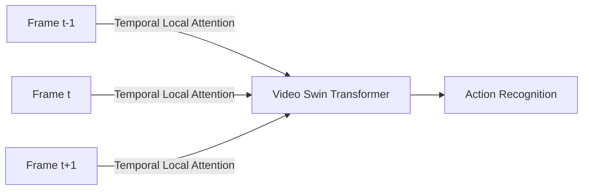

# High-Frame-Rate Video Comprehension

## Overview
High-FPS video processing exhibits massive temporal redundancy. Applying full global self-attention across video frames is computationally impossible. Temporal sliding window attention focuses on temporal neighborhoods, reducing the workload.

## Key Implementation
- **Video Swin Transformer:** Employs local spatiotemporal window attention to extract short-term temporal shifts, capturing motion without cross-frame bottlenecks.

## Diagram

---
[← Back to README](../README.md)
