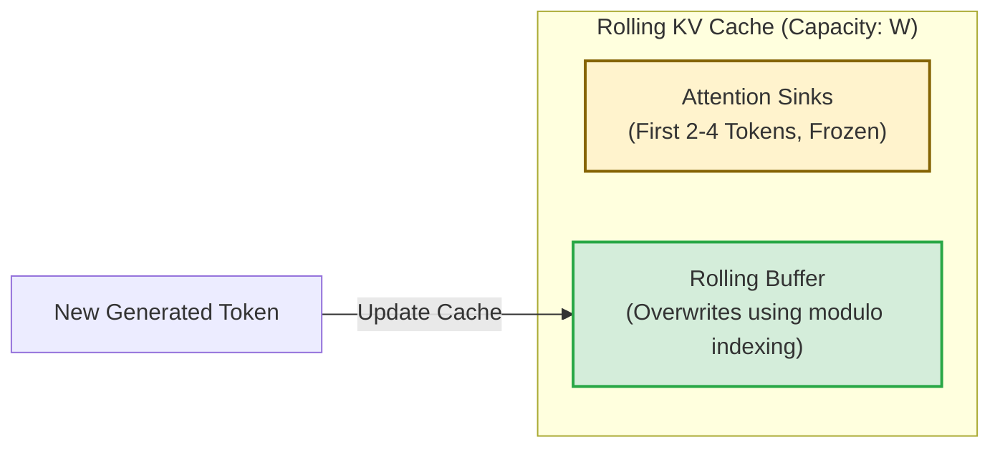

# The Modern Rolling Cache & Attention Sink Era (~2023–Present)

## Overview
The modern era focuses on practical LLM inference scaling. Instead of using complex static masks during training, sliding windows are refactored into **hardware-fused caching mechanisms** and **attention sinks** during inference to support infinite streaming generation.

## Core Concept
In autoregressive text generation, the Key-Value (KV) cache grows linearly. This era introduced:
1. **Rolling KV Cache:** Limits VRAM footprint to a fixed window $W$ by continuously overwriting the oldest cache slots.
2. **Attention Sinks:** Retains the first few tokens (2–4 tokens) permanently in the KV cache, preventing catastrophic perplexity collapse.

## Key Implementations
- **StreamingLLM (Xiao et al., 2023):** Discovered that LLMs assign disproportionately high attention scores to the absolute first tokens in a sequence, acting as a softmax normalization anchor (attention sink).
- **Mistral 7B (Jiang et al., 2023):** Integrated sliding window attention and rolling KV cache into a production-grade 7B model.

## Diagram

---
[← Back to README](../README.md)
