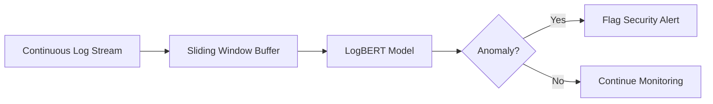

# Continuous Real-Time Streaming Log Analysis

## Overview
Sliding window attention is highly suitable for processing continuous log streams. Rather than reloading context windows, models use rolling attention bounds to analyze high-throughput log logs 24/7.

## Key Implementation
- **LogBERT:** Frames log anomaly detection as a sequence masking task, detecting anomalies within local context blocks without saturating system RAM.

## Diagram

---
[← Back to README](../README.md)
