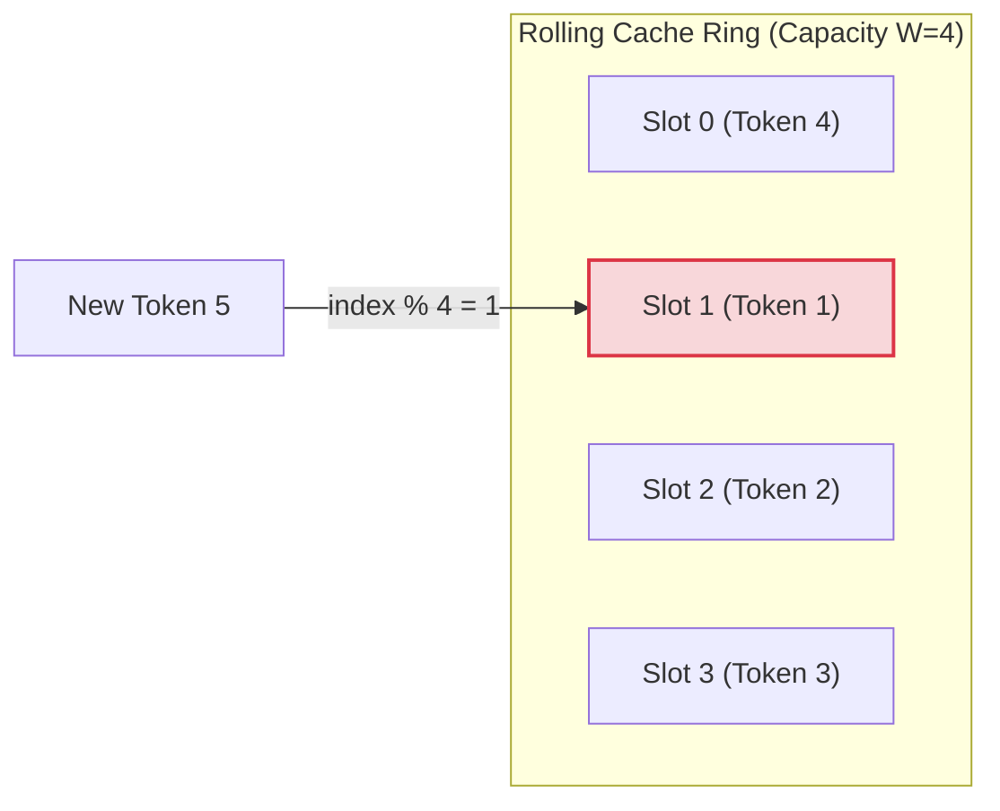

# Rolling KV Cache

## Overview
In standard Transformers, the Key-Value (KV) cache grows linearly with generation length. The **Rolling KV Cache** resolves this by capping cache memory size.

## Mechanism
The system maintains a fixed-capacity VRAM cache equal to the window size $W$. When generating token $i$, its KV coordinates overwrite the memory slot of token $i - W$ using a modulo operation:
$$\text{Slot Index} = i \pmod W$$

## Advantages
- **Constant Memory Footprint:** VRAM consumption remains flat and unchanging whether generating 100 or 100,000 tokens.
- **Hardware Integration:** Combines well with hardware-level memory pooling strategies.

## Diagram

---
[← Back to README](../README.md)
