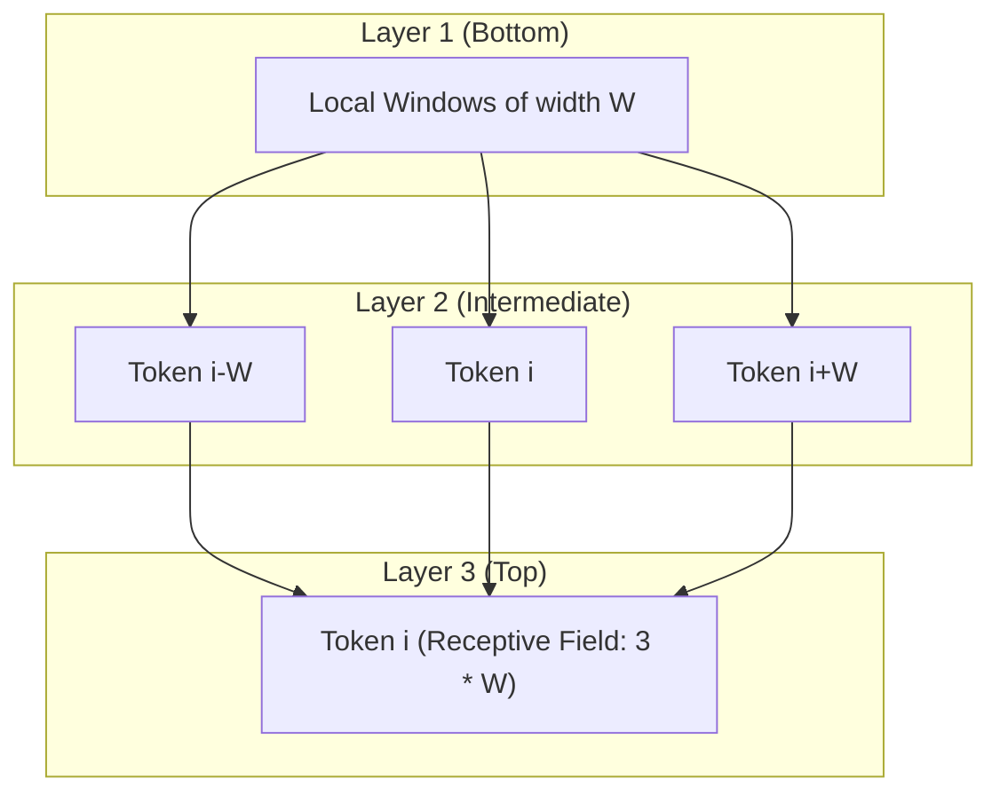

# Standard Vanilla Sliding Window Attention

## Overview
The **Standard Vanilla Sliding Window Attention** is the most direct implementation of local context restriction. It serves as the baseline for sparse attention configurations.

## Mechanism
A query token $i$ only computes attention with key tokens that fall within a symmetric window of size $W$.
$$\text{Scope}(i) = \{j \mid i - \frac{W}{2} \le j \le i + \frac{W}{2}\}$$

## Receptive Field Expansion
Although a single layer is strictly local, stacking multiple layers causes the effective receptive field to expand linearly with network depth. For a model with $L$ layers and window size $W$, the effective receptive field at layer $L$ is:
$$\text{Receptive Field} = L \times W$$

This hierarchy allows high-level representations to capture long-range semantic dependencies without requiring quadratic attention computation.

## Diagram

---
[← Back to README](../README.md)
