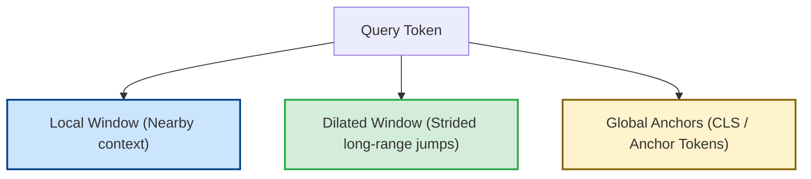

# The Structured Hybrid Era (Longformer / BigBird, ~2020–2022)

## Overview
To address the isolation problem of the Flat Heuristic Era, the **Structured Hybrid Era** introduced configurations combining local sliding windows with global anchors and dilated attention. This allowed long-context processing while retaining sparse computation.

## Core Concept
This era blended three attention patterns:
1. **Local Sliding Window:** Captures nearby context.
2. **Dilated Sliding Window:** Extends the receptive field by skipping tokens at regular intervals.
3. **Global Attention:** Designates specific tokens (like the `[CLS]` token or task-specific anchors) to attend to all sequence tokens and vice versa.

## Key Implementations
- **Longformer (Beltagy et al., 2020):** Formulated local window attention, dilated window attention, and task-specific global attention for long documents.
- **BigBird (Zaheer et al., 2020):** Combined local window attention, global tokens, and random sparse attention, proving that sparse attention is a universal approximator of sequence functions.

## Limitations
- **Hardware Inefficiency:** GPUs are highly optimized for dense matrix multiplications. Arbitrary sparse masks and unstructured indexing introduce heavy memory latency overhead, reducing theoretical speedups.

## Diagram

---
[← Back to README](../README.md)
